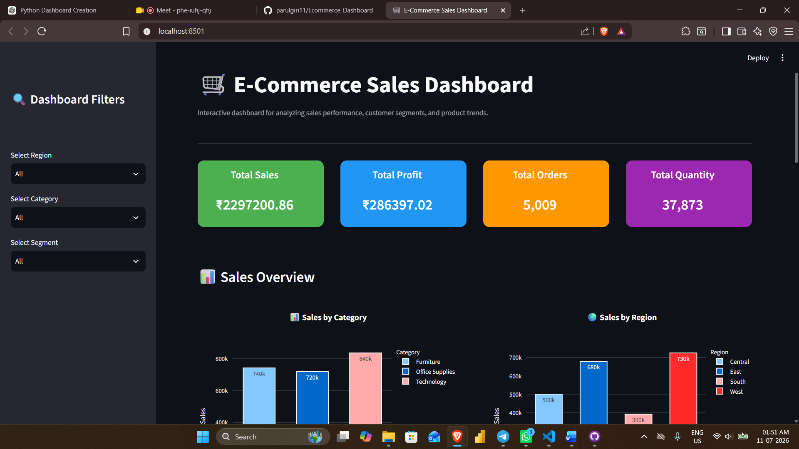

# 🛒 E-Commerce Sales Dashboard

An interactive **E-Commerce Sales Dashboard** built using **Python, Streamlit, Pandas, and Plotly**. The dashboard enables users to analyze sales performance, profitability, customer segments, regional trends, and product performance through dynamic filters and interactive visualizations.

---

## 📌 Project Overview

This dashboard provides valuable business insights by allowing users to explore sales data using multiple filters and interactive charts.

The project demonstrates practical skills in:

- Data Cleaning
- Data Analysis
- Data Visualization
- Dashboard Development
- Business Intelligence

---

## 🚀 Features

### 📊 Interactive Filters
- Region
- Category
- Segment

### 📈 KPI Cards
- 💰 Total Sales
- 📈 Total Profit
- 🛒 Total Orders
- 📦 Total Quantity

### 📉 Interactive Visualizations
- Sales by Category
- Sales by Region
- Monthly Sales Trend
- Sales by Customer Segment (Donut Chart)
- Top 10 Best-Selling Products

### 📥 Additional Features
- Download Filtered Data (CSV)
- Responsive Layout
- Interactive Plotly Charts
- Custom Styled KPI Cards
- Sidebar Filters

---

## 🛠️ Tech Stack

| Technology | Purpose |
|------------|---------|
| Python | Programming Language |
| Streamlit | Dashboard Development |
| Pandas | Data Manipulation |
| Plotly Express | Interactive Visualizations |
| OpenPyXL | Reading Excel Files |

---

## 📂 Dataset

**Dataset Used:** Sample Superstore Dataset

Main columns used:

- Order Date
- Region
- Category
- Segment
- Sales
- Profit
- Quantity
- Product Name

---

# 📸 Dashboard Screenshots

## Dashboard Overview

> Add your dashboard screenshot here.

```markdown

```

---

## KPI Cards

```markdown

```

---

## Sales Analysis

```markdown

```

---

## Filters

```markdown

```

---

# 📊 Dashboard Workflow

```
Excel Dataset
        │
        ▼
Data Loading (Pandas)
        │
        ▼
Data Cleaning
        │
        ▼
KPI Calculation
        │
        ▼
Interactive Filters
        │
        ▼
Plotly Visualizations
        │
        ▼
Streamlit Dashboard
```

---

## 📁 Project Structure

```
Ecommerce_Dashboard/
│
├── app.py
├── README.md
├── requirements.txt
├── SampleSuperstore+dataset.xlsx
│
├── images/
│   ├── dashboard_overview.png
│   ├── kpi_cards.png
│   ├── sales_analysis.png
│   └── sidebar_filters.png
│
└── screenshots/
```

---

## ▶️ Installation

### Clone the Repository

```bash
git clone https://github.com/yourusername/Ecommerce_Dashboard.git
```

---

### Navigate to Project Folder

```bash
cd Ecommerce_Dashboard
```

---

### Install Required Libraries

```bash
pip install -r requirements.txt
```

---

### Run the Dashboard

```bash
streamlit run app.py
```

---

## 📦 Requirements

Create a **requirements.txt** file containing:

```text
streamlit
pandas
plotly
openpyxl
```

---

## 💡 Business Insights

The dashboard helps answer questions such as:

- Which region generates the highest sales?
- Which category is the most profitable?
- Which customer segment contributes the highest revenue?
- How do sales change over time?
- Which products generate the highest sales?

---

## 🎯 Learning Outcomes

Through this project, I gained hands-on experience in:

- Python Programming
- Pandas Data Analysis
- Streamlit Dashboard Development
- Interactive Plotly Visualizations
- Dashboard Design
- Business Intelligence Reporting
- Data Storytelling

---

## 👩‍💻 Author

**Parul Giri**

M.Tech (Computer Science)

Aspiring Data Analyst

### Skills

- Python
- SQL
- Power BI
- Tableau
- Excel
- Pandas
- Plotly
- Streamlit

---

## ⭐ If you found this project useful, please consider giving it a star!
